# 🚀 Creating a Fusion Analytics Warehouse (FAW) Instance

This document provides a complete step-by-step guide to creating a **Fusion Analytics Warehouse (FAW)** instance in Oracle Cloud Infrastructure (OCI), including IAM setup, user synchronization, and instance configuration.

---

## 🧠 Overview

FAW setup involves:

* Creating a user in Fusion (HCM)
* Syncing the user with OCI
* Configuring IAM (Groups & Policies)
* Creating and validating the FAW instance

---

## 👤 Step 1: Create User in HCM

Create a new user with the following details:

**Username:**
`FAWExtractUser`

**Required Roles:**

* Application Implementation Administrator
* ESS Administrator Role
* Upload & Download Data Role
* REST API Extract Privilege

---

## 🔐 Step 2: Login to OCI

Login to OCI using administrator credentials.

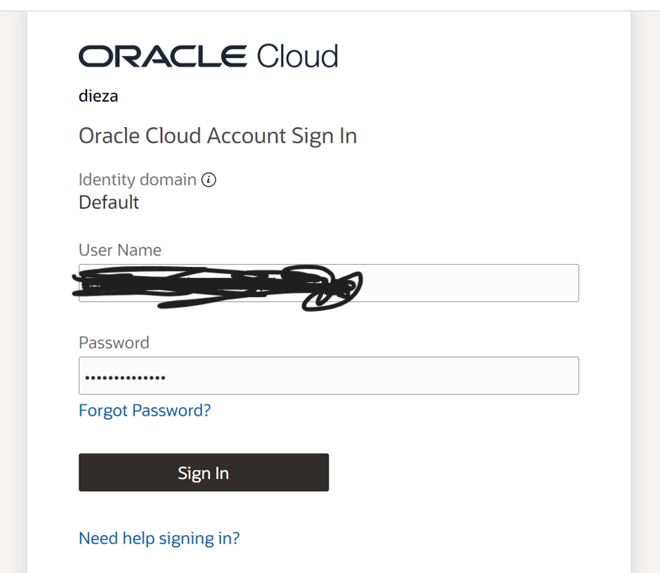

---

## 🔄 Step 3: Sync User to OCI

Navigate to:

```
Identity & Security → Domains → <your-domain>
→ Oracle Cloud Services → Fusion Applications Cloud Service
```

Click on **Import → Import** to sync the user.
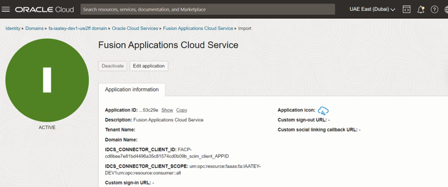
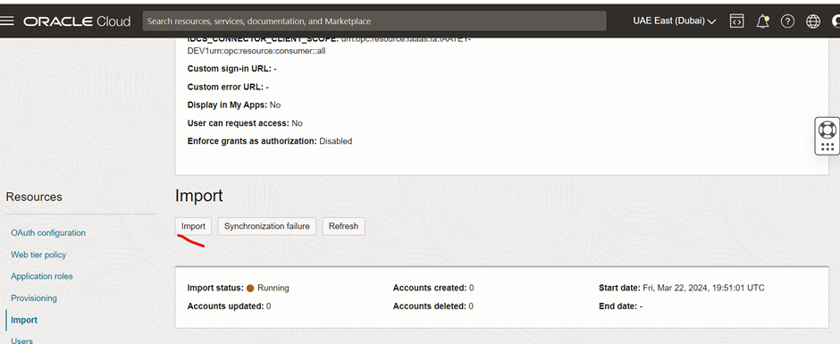

---

## 👥 Step 4: Create Group & Add User

Navigate to:

```
Domains → Groups → Create Group
```

* Group Name: `FAW_ADMIN`
* Add user: `FAWExtractUser`

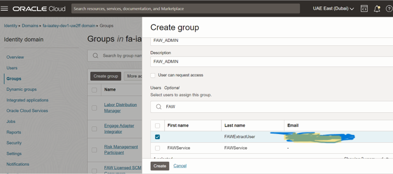

---

## 📜 Step 5: Create Policy

Navigate to:

```
Identity & Security → Policies → Create Policy
```

* Enable **Manual Editor**
* Use the following policy:

```
Allow group id <group_ocid> to manage all-resources in tenancy
```


---

## 📋 Step 6: Verify Policy

Ensure the policy is created successfully.

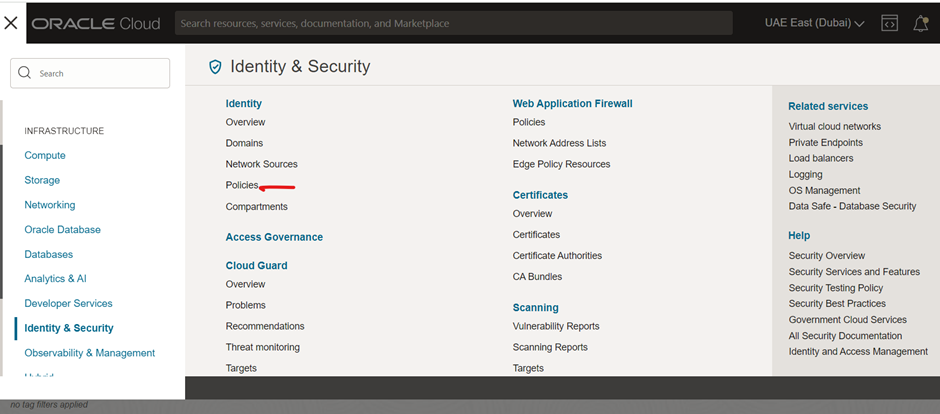
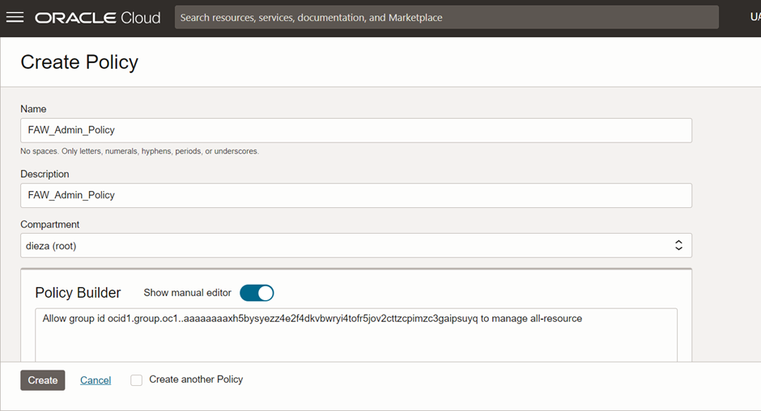

---

## 🔓 Step 7: Login with FAW User

Logout from admin and login using:

* Username: `FAWExtractUser`
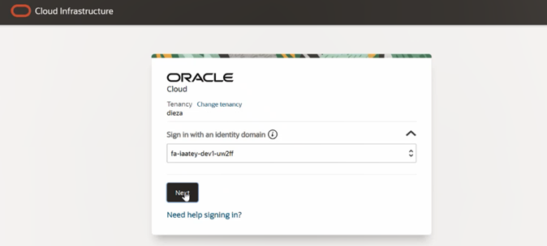
---

## 📂 Step 8: Navigate to FAW Service

Go to:

```
OCI → Analytics & AI → Fusion Analytics Warehouse
```

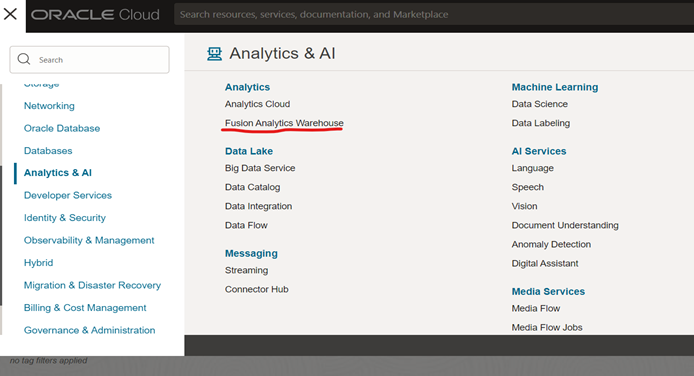
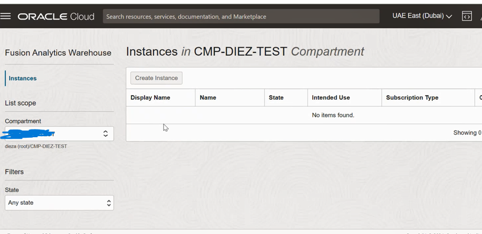

---

## ⚙️ Step 9: Create FAW Instance

Click on **Create Instance** and fill:

* Compartment
* Display Name
* Description
* Notification Email

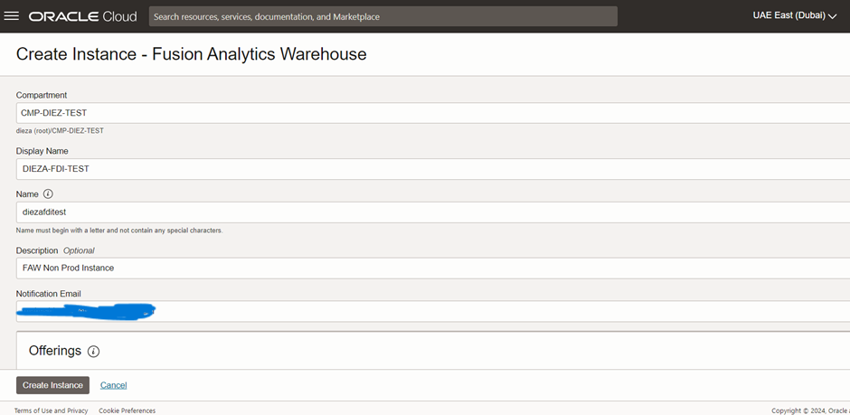

---

## 🔑 Step 10: Configure Authentication

* Provide Fusion URL (Dev URL)
* Select **Password-Based Authentication**
* Enter credentials
* Click **Test Connection**

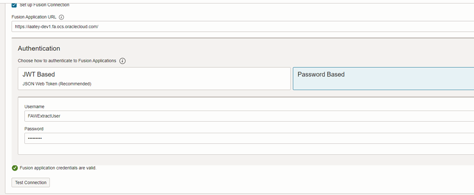


---

## 🌐 Step 11: Network Configuration

* Set Network Access to **Public**

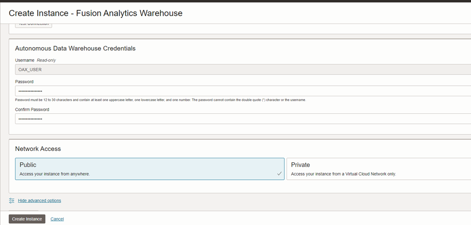

---

## 🏷️ Step 12: Tagging (Optional)

Add tags such as:

* CreatedBy
* CreatedOn

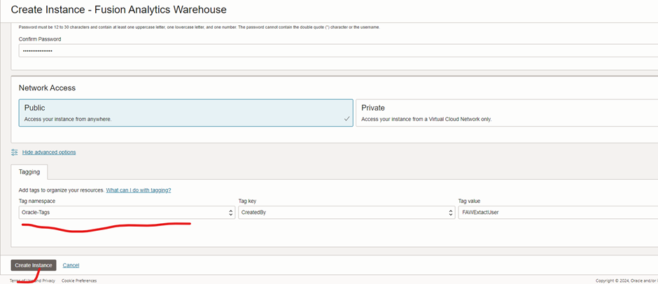

---

## 🧱 Step 13: Final Creation

Click **Create Instance**


⏳ Instance creation takes approximately **30–40 minutes**

---

## ✅ Step 14: Instance Created

Once completed, verify:

* FAW URL
* Analytics Cloud access
* Autonomous Data Warehouse

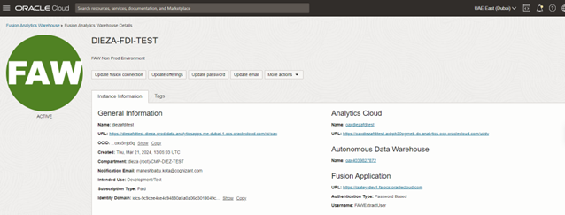

---

## 💡 Key Takeaways

* User synchronization from Fusion to OCI is mandatory
* IAM (Groups & Policies) setup is critical
* Authentication must be validated before creation
* FAW integrates multiple components (Fusion + ADW + Analytics)

---

## 🔗 Part of Portfolio

This is part of my Oracle Data & Analytics Journey:

👉 https://github.com/Rufus9640/oracle-data-journey
